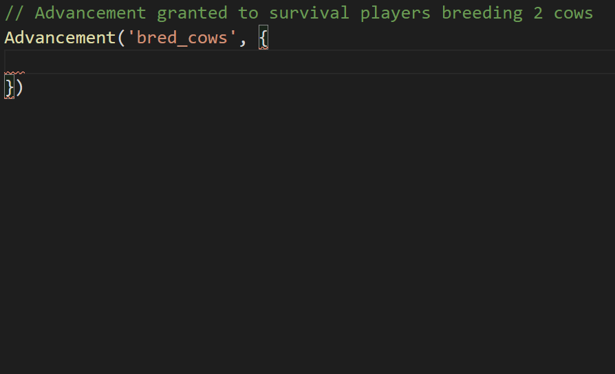

## Introduction
Sandstone features fully-typed advancements. Like for all resources, you need to provide a name, which can include a namespace and folders. You then provide the definition of the advancement.

## Syntax

### Minimal

The minimal syntax for advancements is the following:
```ts
import { Advancement } from 'sandstone/core'

Advancement('advancement_name', {
  criteria: {
    'criteria_name': {
      trigger: 'trigger_name',
      conditions: {
        /* conditions */
      }
    }
  }
})
```

As you can see, you must provide at least 1 criteria. It must have a name, and a trigger. The trigger is autocompleted from a list of all possible triggers. Once you specified a `trigger`, the `conditions` object will tell you what properties are possible.

### Example



### Additional properties

All additional properties can be directly found via autocompletion (as shown above), or by looking at the [Minecraft wiki article on Advancements](https://minecraft.gamepedia.com/Advancement/JSON_format#File_Format).

## Usage

### Granting / revoking

Sandstone Advancements have several methods mimicking the `/advancement` command:

```ts
const myAdvancement = Advancement(...)

// Grant / revoke this advancement
myAdvancement.grant(...)
myAdvancement.revoke(...)

// Grant / revoke this advancement and all its children advancements
myAdvancement.grantFrom(...)
myAdvancement.revokeFrom(...)

// Grant / revoke this advancement and all its parents advancements
myAdvancement.grantUntil(...)
myAdvancement.revokeUntil(...)

// Grant / revoke this advancement, all its parents, and all its children advancements
myAdvancement.grantThrough(...)
myAdvancement.revokeThrough(...)
```

### In selectors

You can also check for a specific advancement in selectors. Let's say you have an advancement named `breedCowsAdvancement`, granted to players who bred cows. You can select players who have this advancement with the following syntax:
```ts
const playerWhoBredCows = Selector('@a', {
  advancements: {
    [breedCowsAdvancement.name]: true
  }
})
```

You can also check for specific criterias. Let's create a new advancement to check if the player bred cows & chicken:
```ts
const breedAnimalsAdvancement = Advancement('breed_cows_and_chicken', {
  criteria: {
    bred_cows: {
      trigger: 'minecraft:bred_animals',
      conditions: {
        child: { type: 'minecraft:cow' },
      },
    },
    bred_chickens: {
      trigger: 'minecraft:bred_animals',
      conditions: {
        child: { type: 'minecraft:chicken' },
      },
    },
  },
})
```

There are 2 criterias: `bred_cows` and `bred_chicken`. Knowing this, you can check for a player who bred cows but did not bred chickens:
```ts
Selector('@a', {
  [bredAnimalsAdvancement.name]: {
    bred_cows: true,
    bred_chickens: false,
  }
})
```

## Known bug

The `requirements` property only accepts actual criteria names. This is to ensure the datapack will actually run in Minecraft. However, the autocompletion does not work on them, even though the criteria names could be infered. This is due to a Typescript bug: if it is annoying to you, please vote on [this issue.](https://github.com/microsoft/TypeScript/issues/41645)